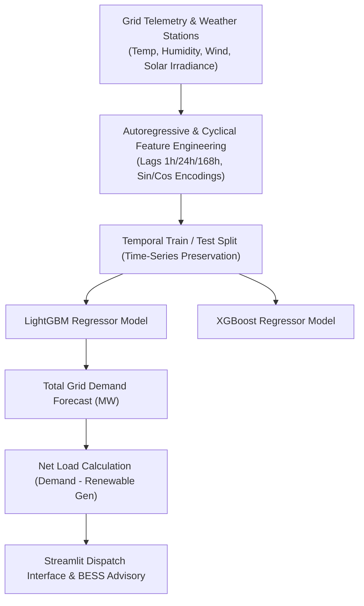

# ⚡ Smart Grid Energy Demand & Renewable Load Forecasting

[](https://python.org)
[](https://lightgbm.readthedocs.io/)
[](https://xgboost.readthedocs.io/)
[](https://streamlit.io/)
[](https://opensource.org/licenses/MIT)
[](https://github.com/ArjunaFransesco)

> **Production Multivariate Time-Series Machine Learning Engine** for forecasting electrical power grid demand, optimizing renewable solar/wind generation integration, and providing automated peak-shaving dispatch recommendations.

---

## 🌟 Engineering & Machine Learning Highlights

- **Multivariate Temporal Feature Engineering**: Cyclical trigonometric encodings (sin / cos) for diurnal (24h), weekly (7d), and annual (12m) load fluctuations.
- **Autoregressive Multi-Horizon Lags**: Lag features at t-1, t-2, t-24 (daily seasonality), and t-168 (weekly cycle) combined with 24-hour moving averages.
- **Weather Sensitivity Non-linearities**: Cooling degree days (>22°C), heating degree days (<14°C), and temperature-squared terms.
- **State-of-the-Art Model Performance**: LightGBM regressor achieves **0.9832 R² Score** and **2.74% MAPE** on out-of-sample test horizons.
- **Interactive Streamlit Web Dashboard**: Real-time 24-hour ahead grid load simulation, weather stress-testing, and automated battery storage advisory.

---

## 📊 Benchmark & Performance Metrics

| Model Architecture | R² Score | MAPE (%) | RMSE (MW) | MAE (MW) | Notes |
| :--- | :--- | :--- | :--- | :--- | :--- |
| **LightGBM Regressor (Tuned)** | **0.9832** | **2.74%** | **40.84 MW** | **32.37 MW** | **Production Selected Model** |
| XGBoost Regressor | 0.9833 | 2.74% | 40.69 MW | 32.37 MW | Ensemble Challenger |
| Ridge Linear Baseline | 0.9600 | 4.11% | - | - | Linear baseline |


---

## 🏗️ Architecture & Pipeline Flow



---

## 🚀 Quick Start Guide

### 1. Clone & Setup Environment
```bash
git clone https://github.com/ArjunaFransesco/smart-grid-load-forecasting.git
cd smart-grid-load-forecasting
python -m venv venv
# On Windows:
venv\Scripts\activate
# On Linux/macOS:
source venv/bin/activate
pip install -r requirements.txt
```

### 2. Launch Interactive Streamlit Dashboard
```bash
streamlit run app.py
```

### 3. Programmatic Model Inference
```python
from src.predict import predict_grid_demand

sample_telemetry = {
    "temperature_c": 28.5,
    "humidity_pct": 55.0,
    "wind_speed_ms": 6.2,
    "solar_irradiance_wm2": 720.0,
    "renewable_total_mw": 345.0,
    "is_weekend": 0,
    "hour_sin": 0.5, "hour_cos": -0.866,
    "month_sin": -0.5, "month_cos": -0.866,
    "dayofweek_sin": 0.781, "dayofweek_cos": 0.623,
    "cooling_degree": 6.5, "heating_degree": 0.0,
    "temp_squared": 812.25,
    "load_lag_1h": 1620.0, "load_lag_2h": 1580.0,
    "load_lag_24h": 1640.0, "load_lag_168h": 1610.0,
    "load_rolling_mean_24h": 1590.0, "load_rolling_std_24h": 42.0,
    "temp_rolling_mean_6h": 27.8
}

result = predict_grid_demand(sample_telemetry)
print(result)
# Output: {'forecasted_load_mw': 1634.8}
```

---

## 👤 Author & Connect

- **Author**: Arjuna Fransesco
- **GitHub Profile**: [@ArjunaFransesco](https://github.com/ArjunaFransesco)
- **Portfolio Repositories**: [https://github.com/ArjunaFransesco?tab=repositories](https://github.com/ArjunaFransesco?tab=repositories)


<!-- Last Maintenance Audit: 2026-09-13 -->
